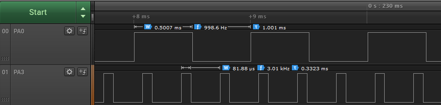

# Generating Two PWM Signals in Split Mode

This code example shows how to initialize the Timer/Counter Type A (TCA) in Split mode to generate two single-slope 8-bit Pulse-Width Modulation (PWM) signals on two GPIO pins. The signals will be configured with different frequencies and different duty cycles, as follows:
- 1 kHz PWM signal with 50% duty cycle
- 3 kHz PWM signal with 25% duty cycle

## Related Documentation
More details and code examples on the ATMEGA4809 can be found at the following links:
- [TB3217-Getting Started with Timer/Counter Type A (TCA)](http://ww1.microchip.com/downloads/en/Appnotes/TB3217-Getting-Started-with-TCA-90003217A.pdf)
- [ATMEGA4809 Product Page](https://www.microchip.com/wwwproducts/en/ATMEGA4809)
- [ATMEGA4809 Code Examples on GitHub](https://github.com/microchip-pic-avr-examples?q=atmega4809)
- [ATMEGA4809 Project Examples in START](https://start.atmel.com/#examples/ATMEGA4809XplainedPro)

## Software Used
- Microchip Studio 7.0.2397 or newer [(microchip.com/mplab/microchip-studio)](microchip.com/mplab/microchip-studio)
- ATmega_DFP 1.6.364 or newer Device Pack

## Hardware Used
- ATMEGA4809 Xplained Pro [(ATMEGA4809-XPRO)](https://www.microchip.com/developmenttools/ProductDetails/ATMEGA4809-XPRO)

## Setup
The ATMEGA4809 Xplained Pro Development Board is used as test platform.

 

The following configurations must be made for this project:

<Configurations>

System clock is 3.33 MHz.

TCA0:
- Clock Selection: System clock/16
- Timer Mode: 8-Bit (Split)
- Signal with Output on PA0 has One kHz Frequency and 50% Duty Cycle
- Signal with Output on PA3 has three kHz Frequency and 25% Duty Cycle
- Output on Channel 0
- Output on Channel 3

| Pin |  Configuration    |
| :-: | :---------------: |
| PA0 |   Digital output  |
| PA3 |   Digital output  |

 ## Operation
 1. Connect the board to the PC.

 2. Open the atmega4809-getting-started-with-tca-studio.atsln solution in Microchip Studio.

 3. Set the **Generating_Two_PWM_Signals_in_Split_Mode** project as Start-Up project. Right click on the project in the **Solution Explorer** tab and click **Set as StartUp Project**.

 

 4. Build the **Generating_Two_PWM_Signals_in_Split_Mode** project: Right click on the **atmega4809-getting-started-with-tca-studio** solution and select **Build Solution**.

 

 5. Select the **ATMEGA4809 Xplained Pro** in the Connected Hardware Tool section of the project settings:
   - Right click on the project and click **Properties**
   - Click on the **Tool** tab.
   - Select the **ATMEGA4809 Xplained Pro** (click on the **SN**) in the **Selected debugger/programmer** section, and save (CTRL + S):

 

 6. Program the project to the board: Click on the **Debug** tab and click **Start Without Debugging**.

 

## Demo

The PWM signals generated by the TCA0 can be seen in the following image.

 

The first waveform period is approximately 1 kHz and its duty cycle is 50%. The second waveform period is approximately 3 kHz and its duty cycle is 25%.

## Summary

This code example shows how to initialize the TCA in Split mode to generate two single-slope 8-bit PWM signals on two GPIO pins, with independent duty cycle and frequency.
